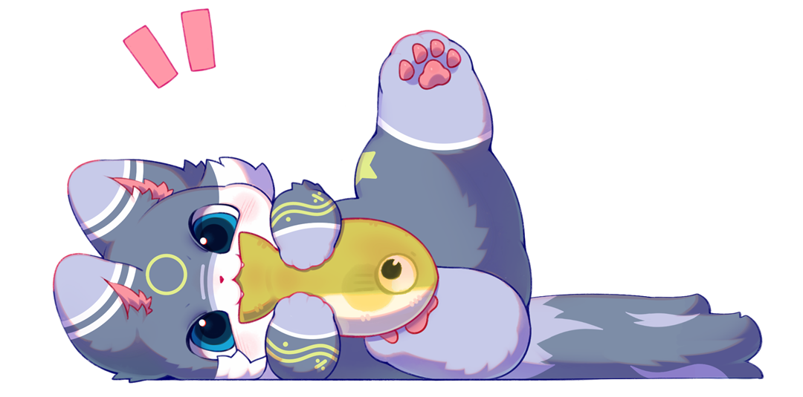

  
  

  

  🐾🐾🐾🐾🐾🐾🐾🐾🐾🐾🐾🐾🐾🐾🐾🐾🐾🐾🐾🐾

<table border="0">
  <tr>
    <td width="100%" valign="top">
      <h2 align="center">✨ ฅ^•ﻌ•^ฅ  嗨！我是酪灰，很高兴见到你！</h2>
      

        &nbsp;&nbsp;&nbsp;&nbsp;&nbsp;&nbsp;英文名 NanoRocky，一只主修<b>计算机应用技术</b>的大一呆呆猫。正在努力从 “只会敲 Hello World” 的新手猫，成长为摆烂的躺平猫！（？）
      

      

        🐾 <b>当前习得：</b> Vue.js, Python, C++, PHP (Level 1 🌿)  
        🐾 <b>正在磨爪：</b> 数据结构与算法  
        🐾 <b>领地分布：</b> 喜欢 Furry 和开源探索 
      

    </td>
  </tr>
</table>

  🐾🐾🐾🐾🐾🐾🐾🐾🐾🐾🐾🐾🐾🐾🐾🐾🐾🐾🐾🐾

---

### 🍪 技能饼干盒

  

---
### 🍳 猫猫的厨具

  

---

### 📊 摸鱼统计

  
  

  🐾🐾🐾🐾🐾🐾🐾🐾🐾🐾🐾🐾🐾🐾🐾🐾🐾🐾🐾🐾

  

  🐾🐾🐾🐾🐾🐾🐾🐾🐾🐾🐾🐾🐾🐾🐾🐾🐾🐾🐾🐾

  

---

### 📫 捕捉猫猫

  
  
  
  
  
  
  
  
  
     
  