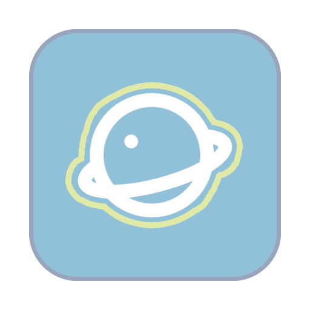
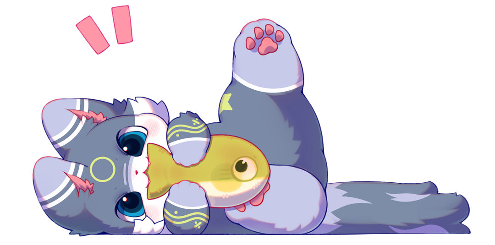

  
  

  

  🐾🐾🐾🐾🐾🐾🐾🐾🐾🐾🐾🐾🐾🐾🐾🐾🐾🐾🐾🐾

  <h2>✨ ฅ^•ﻌ•^ฅ  嗨！我是酪灰，很高兴见到你！</h2>
  

    英文名 NanoRocky，一只主修<b>计算机应用技术</b>的大二呆呆猫。
    正在努力从 “只会敲 Hello World” 的新手猫，成长为摆烂的躺平猫！（？）
  

  

    &nbsp;&nbsp;&nbsp;🐾 <b>当前习得：</b> Vue.js, TypeScript, Python, C++, PHP (Level 1 🌿)  
    &nbsp;&nbsp;&nbsp;🐾 <b>正在磨爪：</b> Touching fish (摸鱼)  
    &nbsp;&nbsp;&nbsp;🐾 <b>领地分布：</b> 喜欢 Furry 和开源探索 
  

  🐾🐾🐾🐾🐾🐾🐾🐾🐾🐾🐾🐾🐾🐾🐾🐾🐾🐾🐾🐾

---

### 🍪 技能饼干盒

  

---
### 🍳 猫猫的厨具

  

---

### 📊 摸鱼统计

  
  

  🐾🐾🐾🐾🐾🐾🐾🐾🐾🐾🐾🐾🐾🐾🐾🐾🐾🐾🐾🐾

  

  🐾🐾🐾🐾🐾🐾🐾🐾🐾🐾🐾🐾🐾🐾🐾🐾🐾🐾🐾🐾

  

---

### 📫 捕捉猫猫

  &nbsp;
  &nbsp;
  &nbsp;
  &nbsp;
  &nbsp;
  &nbsp;
  &nbsp;
  &nbsp;
  
     
  
